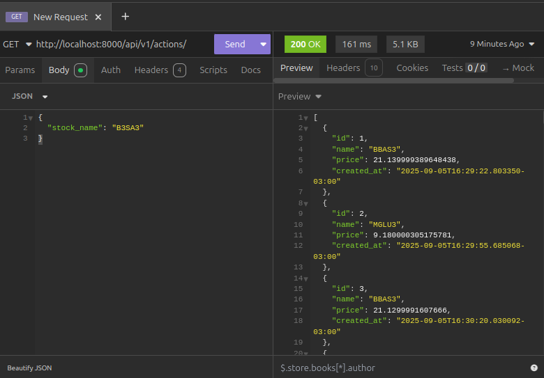

# InvestData

Bem-vindo ao Sistema InvestData. Projeto que faz buscar automaticamente dos valores de ações na bolsa de valores.

## 🛠 Tecnologias
- Python 3.11
- Django 5
- Django REST Framework
- PostgreSQL
- Celery + RabbitMQ
- Docker & Docker Compose

## Requisitos

Certifique-se de que você tenha os seguintes requisitos instalados em seu sistema:

- Docker
- Python
- Django
- PostgreSQL
- Celery
- Outras dependências listadas no arquivo `requirements.txt`

## Instalação das Dependências

Crie e ative um ambiente virtual
```bash
python3 -m venv venv

source venv/bin/activate
```

Com o ambiente virtual ativado, instale as dependências do projeto usando o comando:
```bash
pip install -r requirements.txt
```

## Rodar o projeto

Git clone:
```bash
https://github.com/Joao-Batista-Dev/InvestData
```

Entre no diretório do projeto
```bash
cd investdata
```

Execute o docker:
```bash
docker-compose up --build
```

Criando um usuário admin:
```bash
docker-compose exec investdata_web python manage.py createsuperuser
```

Após isso, o sistema estará pronto para ser acessado em:
[http://localhost:8000](http://localhost:8000)

## 🎥 Demonstração

